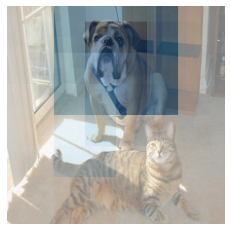
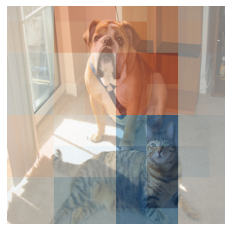

# Squaregrid Implementation 

<p float="left">
  
   
</p>


----------

Basic usage: 
```
from squaregrid.explain_image import SquareGrid

explainer = SquareGrid()
explanation = explainer.explain(image,model)
```

Generates a LIME explanation heatmap for image classifications using grids of squares as a segmentation. Provides a rough heatmap, but doesn't require as fine tuning like the other segmentation algorithms (Felzenszwalb, Quickshift, SLIC, etc)

----------
## A note on image preprocessing and explanations
The explain() function receives an image and a model.

The image to be explained is expected to be in the input_shape used by the model, without any color
normalization or futher preprocessing applied yet.
This makes it easier to be consistent among different models that may have wildly different preprocessing routines.

Ideally the any color normalization/preprocessing is included within the model class/function. Tensorflow 2.0 allows this easily with preprocessing layers ( https://www.tensorflow.org/guide/keras/preprocessing_layers).

However many users have separate preprocessing routines that are applied before the image is sent to the model for classification. A quick fix to make this work with this implementation is to define a model class that receives your model and adds the preprocessing step to the predict() method:

```
class MyModel():
    def __init__(self,model):
        self.model = model
        self.input_shape = model.input_shape
        self.output_shape = model.output_shape
        
    def predict(self, batch_images):
        
        batch_images = your_preprocessing(batch_images) 
        
        return self.model.predict(batch_images)


model_with_preprocessing = MyModel(your_model)
```

You can customize this class as much as necessary. The explain() function only needs to be able to call the predict() method and input_shape/output_shape attributes.
